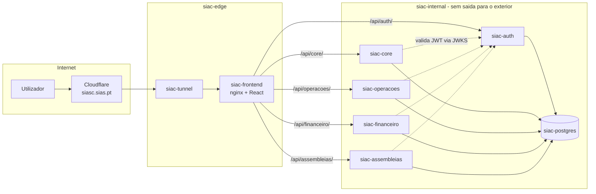

# SIASC — Arquitetura

Reconstrução do SIASC sobre a base validada da v1 (túnel, redes e isolamento),
agora com backend Spring Boot em micro-serviços. Estrutura de execução
semelhante à do home03: containers Docker, redes segregadas edge/internal,
exposição exclusiva via túnel Cloudflare.

## 1. Visão geral

O frontend é o único ponto de entrada: o nginx serve a SPA e encaminha
`/api/<serviço>/**` para o container respetivo. Não há gateway dedicado na
fase inicial — o nginx cumpre esse papel; se a complexidade justificar,
avalia-se Spring Cloud Gateway mais tarde.

## 2. Containers

| Container | Imagem base | Redes | Limites (iniciais) | Fase |
|---|---|---|---|---|
| `siac-tunnel` | `cloudflare/cloudflared` | `siac-edge` | 0.10 cpu / 128m | já existe |
| `siac-frontend` | `nginx:alpine` (build Vite) | `siac-edge`, `siac-internal` | 0.25 cpu / 128m | 0 |
| `siac-postgres` | `postgres:17` | `siac-internal` | 0.50 cpu / 512m | 0 |
| `siac-auth` | `eclipse-temurin:21-jre` | `siac-internal` | 0.50 cpu / 384m | 1 |
| `siac-core` | `eclipse-temurin:21-jre` | `siac-internal` | 0.50 cpu / 384m | 2 |
| `siac-operacoes` | `eclipse-temurin:21-jre` | `siac-internal` | 0.50 cpu / 384m | 3 |
| `siac-financeiro` | `eclipse-temurin:21-jre` | `siac-internal` | 0.50 cpu / 384m | 4 |
| `siac-assembleias` | `eclipse-temurin:21-jre` | `siac-internal` | 0.50 cpu / 384m | 5 |

Notas:
- Host é um Raspberry Pi 5 (ARM64, RAM partilhada com outras stacks): imagens
  têm de suportar arm64; serviços sobem **por fase**, não todos de uma vez.
- JVM afinada para container: `-XX:MaxRAMPercentage=75`, lazy init ativado.
- Non-root: temurin com user dedicado no Dockerfile; nginx com `user: "101:101"`.

## 3. Redes

- **`siac-edge`** — externa; só `siac-tunnel` e `siac-frontend`. Já existe
  (criada por `docker-compose.tunnel.yml`).
- **`siac-internal`** — `internal: true`, sem rota para o exterior; Postgres e
  todos os backends. O frontend liga às duas e faz a ponte via proxy.
- Isolamento face a home03/lostandfound/Nextcloud confirmado a nível de
  bridge Docker — nenhuma partilha de rede ou volume é permitida.

## 4. Exposição pública

Reaproveita-se o túnel `siac` (ID `230328df-d1bd-4f39-a632-7fe11ff37ec2`,
ver `TUNNEL.md`). Regra herdada e mantida: o hostname `siasc.sias.pt` só
aponta para `siac-frontend` **depois** de o login estar funcional
(fase 1 concluída). Até lá, testes fazem-se por `docker exec` / rede interna.

## 5. Micro-serviços

Cada serviço é um projeto Maven independente em `backend/<nome>/`, com o seu
Dockerfile multi-stage (build com `maven:3-eclipse-temurin-21`, runtime JRE),
o seu schema Postgres e as suas migrações Flyway. Comunicação entre serviços é
a exceção, não a regra — quando necessária, é HTTP interno via
`siac-internal`.

| Serviço | Schema | Responsabilidade |
|---|---|---|
| `siac-auth` | `siac_auth` | Utilizadores, credenciais, papéis, **âmbitos**, emissão de JWT (RS256), endpoint JWKS |
| `siac-core` | `siac_core` | Condomínios, blocos, frações, pessoas, ligação pessoa↔fração |
| `siac-operacoes` | `siac_operacoes` | Ocorrências, equipamentos, fornecedores, manutenções |
| `siac-financeiro` | `siac_financeiro` | Quotas, movimentos, mapas |
| `siac-assembleias` | `siac_assembleias` | Convocatórias, atas, deliberações |

### Autenticação e autorização

- `siac-auth` emite JWT assinado com RS256 e publica a chave pública em
  `/.well-known/jwks.json` (acessível só na rede interna).
- Os restantes serviços são *resource servers* (Spring Security OAuth2
  Resource Server) e validam o token localmente via JWKS — sem chamada ao
  auth em cada request.
- O token transporta papéis **e âmbitos** (`[{condominio_id, fracao_id?}]`).
  Cada serviço filtra todas as queries pelo âmbito do token; um
  `condominio_id` pedido pelo cliente é sempre cruzado com os âmbitos —
  mismatch → 403.

## 6. Base de dados

Uma instância `siac-postgres`, base `siac`, um schema por serviço. O bootstrap
(`postgres/init/`) cria schemas e um role por serviço com privilégios apenas
sobre o seu schema (`siac_auth_user` só vê `siac_auth`, etc.). Referências
entre domínios (ex.: `siac_operacoes.ocorrencias.condominio_id`) guardam o id
sem FK cross-schema — a integridade entre serviços é responsabilidade da
camada aplicacional.

Backups: `pg_dump` diário para `~/backups_local` (tarefa da fase 0/6).

## 7. Frontend

SPA única (React + TS + Vite) que consome todos os backends através do proxy
nginx (`/api/auth/`, `/api/core/`, …). Sessão no frontend: token em memória +
refresh; nunca em `localStorage`. Rotas e páginas evoluem por fase, alinhadas
com `docs/requisitos.md`.

## 8. Decisões registadas

- **Micro-serviços desde já, mas ligados por fase** — separa domínios (e
  schemas) sem pagar o custo de RAM de 5 JVMs no dia 1.
- **nginx como gateway** em vez de serviço gateway dedicado — menos um
  container num host pequeno; revisitar se surgir necessidade de rate-limit
  ou lógica de routing complexa.
- **Uma instância Postgres, vários schemas** — isolamento lógico suficiente
  para o host; instâncias separadas seriam desperdício de RAM.
- **Túnel reaproveitado** — infraestrutura já validada; nada a alterar além
  de adicionar o hostname na fase certa.
